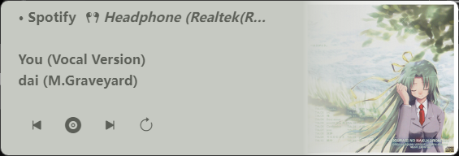

# 一个类似Youtube Music中用于投放到其它设备的卡片的播放挂件

A music widget like Youtube Music's card for playing on other devices.



## 1.使用说明

### 显示模式
1. api模式 (不再维护)
2. smtc模式 (仅限Windows)
```
注意：

使用smtc模式需要支持smtc的播放器。

smtc模式下，从切换歌曲到加载完成时间约为9秒，这取决于封面图片的复杂度。
```

---
左键长按封面部分可以拖动窗口位置。

点击任务栏图标可以最小化窗口，也可从任务栏关闭窗口，当窗口关闭时应用不会关闭，需要右键托盘图标选择关闭。

## 2.SMTC核心

具体信息请参阅 https://github.com/cloudy2331/SmtcNetCore